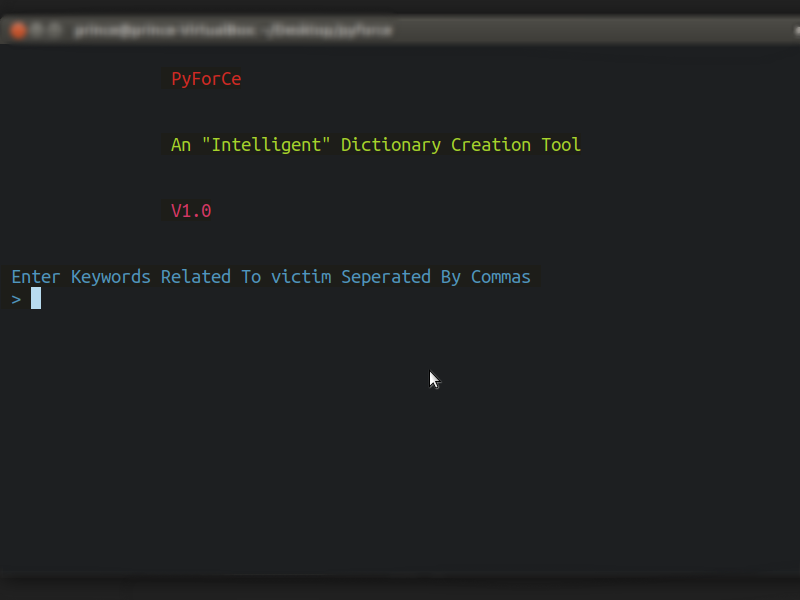
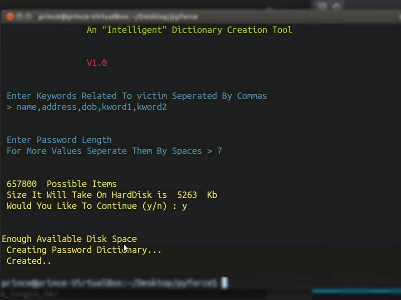

# Intelligent BruteForce Dictionary In Python

## About

***PyForce*** is a simple Program in Python. <br/>
You can create more customized WordList for your **Bruteforce** Attack.
<br/>
I call this Program ***Intelligent*** as it will create large Password Files, only if there is Memory space already available to accumulate it.

***Colors.py is added to give and idea fo color code***

### Code that checks for FreeSpace 

```python

    def checkdiskspace(passfilelength):

    # More code in Between    
    
    if freeGb - pass_file_length_GB > 1:
        print(" \n\nEnough Available Disk Space\n Creating Password Dictionary...")
    else:
        print("\033[91m Your Device Doesn't Have Enough Disk Space..\n Quitting...")
        # code to reset the color changes
        print("\033[0m")
        exit(0)

```

## [Watch A Vlog Here](https://youtu.be/P-SplfN7lMo)

## Screenshots 


